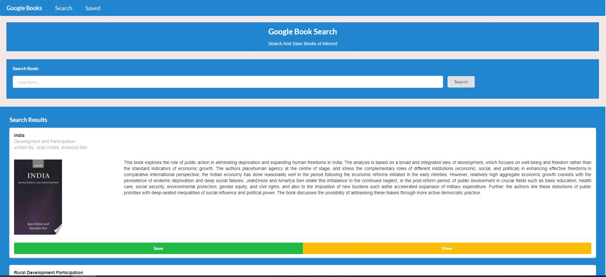

# Google Book Search

## Description
Google Book Search is an app to search book using any text via google book API and save the books details to check later. It is built using MERN(Mongo, Express, React & Node) stack and styled using sematic UI React. The application is currently hosted in heroku and url is given in relevant [section](#URL)
## Table of Contents
* [Installation](#installation)
* [Usage](#usage)
* [License](#license)
* [Contributing](#contributing)
* [Screenshot](#screenshots)
* [URL](#url)
* [Questions](#questions)
## Installation
Please download repository and run npm install and configure mongo DB client.
## Usage
The user should be able to:
  * search books using any text via Google Book API
  * save any searched book(s)
  * view all saved books
  * delete saved books
## Contributing
You are most welcome to contribute. There are following ways to contribute:
1. Please raise a pull request.
2. Please raise a new feature request.
3. Please raise a new issue.
All requests will be reviewed and processed accordingly.
## Screenshots

## URL
https://google-book-search-nm.herokuapp.com/
## License
This application is covered by [MIT](./LICENSE) license
## Questions
* Please raise a request at [github](https://github.com/nitinmuk)
* For any private question/enquiry, please reach out to my email: nitinmukes@gmail.com